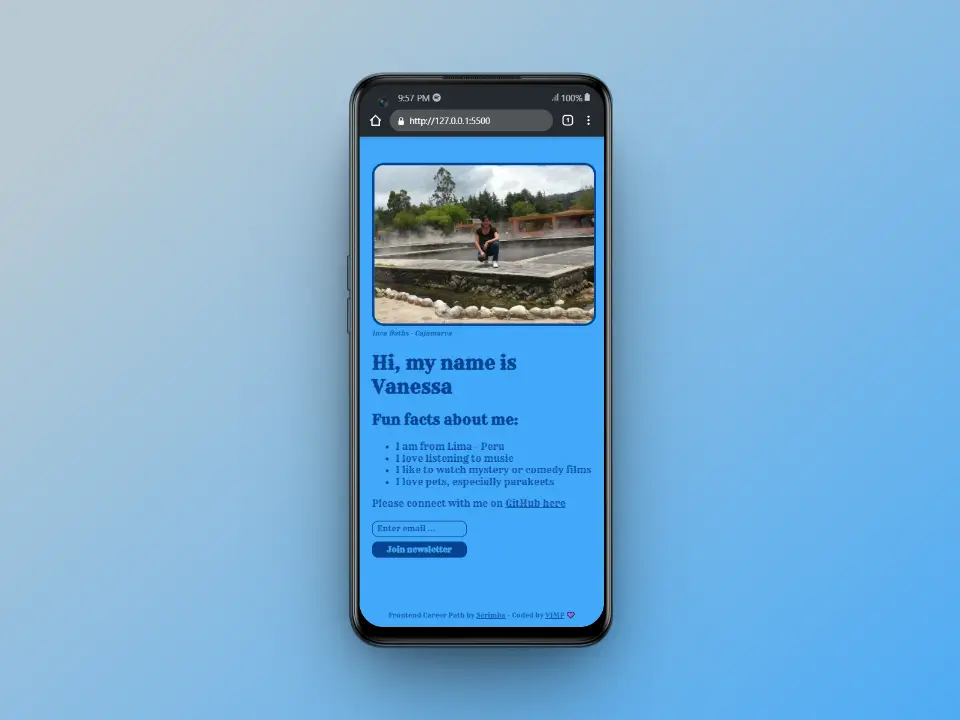
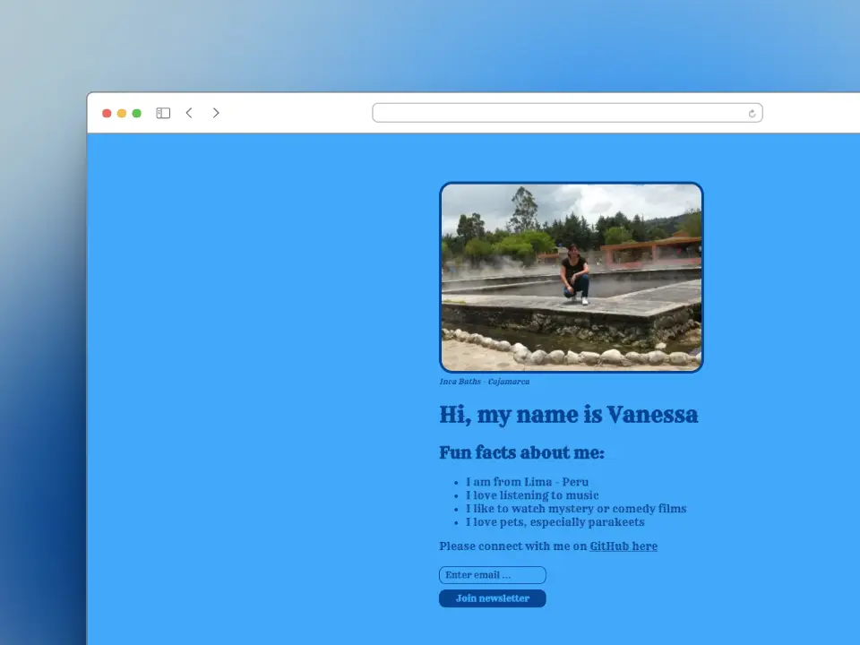

# Personal Website

This is a solution to one of the projects that are part of the `Frontend Career Path - Module 2` by Scrimba.

### 📱 Mobile

### 💻 Desktop

## Links

[Live](https://mendez-v.github.io/personal-website/) 👀

[Scrim](https://scrimba.com/scrim/c8p46mu3)👀

## Useful Resource

🖼 Favicon - <a href="https://iconscout.com/icons/glacier" class="text-underline font-size-sm" target="_blank">Glacier</a> by <a href="https://iconscout.com/contributors/sbts2018" class="text-underline font-size-sm">SBTS</a> on <a href="https://iconscout.com" class="text-underline font-size-sm">IconScout</a>

## Author

✨ Frontend mentor - [@mendez-v](https://www.frontendmentor.io/profile/mendez-v)